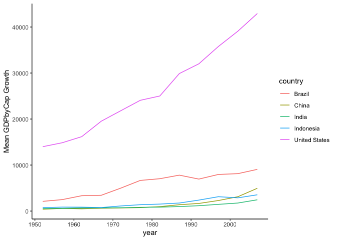

## Instructions
Answer the following questions and complete the exercises in RMarkdown. Please embed all of your code and push your final work to your repository. Your final lab report should be organized, clean, and run free from errors. Remember, you must remove the `#` for the included code chunks to run. Be sure to add your name to the author header above. For any included plots, make sure they are clearly labeled. You are free to use any plot type that you feel best communicates the results of your analysis.  

**In this homework, you should make use of the aesthetics you have learned. It's OK to be flashy!**

Make sure to use the formatting conventions of RMarkdown to make your report neat and clean!  

## Load the libraries

```r
library(tidyverse)
library(janitor)
library(here)
library(naniar)
```

## Resources
The idea for this assignment came from [Rebecca Barter's](http://www.rebeccabarter.com/blog/2017-11-17-ggplot2_tutorial/) ggplot tutorial so if you get stuck this is a good place to have a look.  

## Gapminder
For this assignment, we are going to use the dataset [gapminder](https://cran.r-project.org/web/packages/gapminder/index.html). Gapminder includes information about economics, population, and life expectancy from countries all over the world. You will need to install it before use. This is the same data that we will use for midterm 2 so this is good practice.

```r
#install.packages("gapminder")
library("gapminder")
```

## Questions
The questions below are open-ended and have many possible solutions. Your approach should, where appropriate, include numerical summaries and visuals. Be creative; assume you are building an analysis that you would ultimately present to an audience of stakeholders. Feel free to try out different `geoms` if they more clearly present your results.  

**1. Use the function(s) of your choice to get an idea of the overall structure of the data frame, including its dimensions, column names, variable classes, etc. As part of this, determine how NA's are treated in the data.**  


```r
gapminder <- gapminder
glimpse(gapminder)
```

```
## Rows: 1,704
## Columns: 6
## $ country   <fct> "Afghanistan", "Afghanistan", "Afghanistan", "Afghanistan", …
## $ continent <fct> Asia, Asia, Asia, Asia, Asia, Asia, Asia, Asia, Asia, Asia, …
## $ year      <int> 1952, 1957, 1962, 1967, 1972, 1977, 1982, 1987, 1992, 1997, …
## $ lifeExp   <dbl> 28.801, 30.332, 31.997, 34.020, 36.088, 38.438, 39.854, 40.8…
## $ pop       <int> 8425333, 9240934, 10267083, 11537966, 13079460, 14880372, 12…
## $ gdpPercap <dbl> 779.4453, 820.8530, 853.1007, 836.1971, 739.9811, 786.1134, …
```


```r
naniar::miss_var_summary(gapminder)
```

```
## # A tibble: 6 × 3
##   variable  n_miss pct_miss
##   <chr>      <int>    <dbl>
## 1 country        0        0
## 2 continent      0        0
## 3 year           0        0
## 4 lifeExp        0        0
## 5 pop            0        0
## 6 gdpPercap      0        0
```


**2. Among the interesting variables in gapminder is life expectancy. How has global life expectancy changed between 1952 and 2007?**


```r
gapminder %>%
  group_by(year) %>%
  summarise(mean_exp = mean(lifeExp)) %>%
  ggplot(aes(x = year, y = mean_exp)) + geom_line(group = 1, col = "Blue") + theme_classic() + labs(title = "Life Expecactancy over Time", x="Time (Years)", y = "Mean Exepected Life")
```

<!-- -->


**3. How do the distributions of life expectancy compare for the years 1952 and 2007?**


```r
gapminder %>%
  filter(year == 2007 | year == 1952) %>%
  ggplot(aes(x = lifeExp, group = year, color = year)) +
  geom_density(fill="orchid", alpha  =0.4, color = "black")+
  labs(title = "Distribution of Life Expectancy",
       x = "Life Expectancy") +
  theme_dark()
```

<!-- -->


**4. Your answer above doesn't tell the whole story since life expectancy varies by region. Make a summary that shows the min, mean, and max life expectancy by continent for all years represented in the data.**


```r
gapminder %>%
  group_by(continent) %>%
  summarise(min_age = min(lifeExp),
            mean_age = mean(lifeExp),
            max_age = max(lifeExp))
```

```
## # A tibble: 5 × 4
##   continent min_age mean_age max_age
##   <fct>       <dbl>    <dbl>   <dbl>
## 1 Africa       23.6     48.9    76.4
## 2 Americas     37.6     64.7    80.7
## 3 Asia         28.8     60.1    82.6
## 4 Europe       43.6     71.9    81.8
## 5 Oceania      69.1     74.3    81.2
```


```r
gapminder %>%
  group_by(continent) %>%
  ggplot(aes(x=lifeExp,y = continent)) + geom_boxplot() + theme_classic() + labs(title = "Boxplot of Life Expectancy")
```

<!-- -->


**5. How has life expectancy changed between 1952-2007 for each continent?**


```r
gapminder %>%
  group_by(continent, year) %>%
  summarise(mean_exp = mean(lifeExp)) %>%
  ggplot(aes(x=year, y =mean_exp, group = continent, color = continent)) + geom_line() + theme_classic() + theme(axis.text.x = element_text(angle = 60, hjust=1))
```

```
## `summarise()` has grouped output by 'continent'. You can override using the `.groups` argument.
```

<!-- -->


**6. We are interested in the relationship between per capita GDP and life expectancy; i.e. does having more money help you live longer?**


```r
gapminder %>%
  ggplot(aes(x= gdpPercap, y =lifeExp)) + geom_point(col = "skyblue", na.rm = T) + scale_x_log10() + theme_minimal() + geom_smooth(method = lm, se = F)
```

```
## `geom_smooth()` using formula 'y ~ x'
```

<!-- -->


**7. Which countries have had the largest population growth since 1952?**


```r
gapminder %>%
  select(country, pop, year) %>%
  pivot_wider(names_from = "year",
              names_prefix = "year_",
              values_from = "pop") %>%
  mutate(pop_change = year_2007-year_1952) %>%
  select(country, pop_change) %>%
  arrange(desc(pop_change)) %>%
  top_n(5, pop_change)
```

```
## # A tibble: 5 × 2
##   country       pop_change
##   <fct>              <int>
## 1 China          762419569
## 2 India          738396331
## 3 United States  143586947
## 4 Indonesia      141495000
## 5 Brazil         133408087
```


**8. Use your results from the question above to plot population growth for the top five countries since 1952.**


```r
gapminder %>%
  group_by(year, country) %>%
  filter(country == "China" |
           country == "India" | 
           country == "United States" |
           country == "Indonesia" | 
           country == "Brazil") %>%
  summarise(mean_gr = mean(pop)) %>%
  ggplot(aes(x = year, y = mean_gr, group=country, color= country)) + geom_line() +
  theme(axis.text.x = element_text(angle = 60, hjust=1)) + labs(title = "Population Growth of Fastest 5 Countries", 
                                                                y = "Mean Population Growth") + theme_classic()
```

```
## `summarise()` has grouped output by 'year'. You can override using the `.groups` argument.
```

<!-- -->


**9. How does per-capita GDP growth compare between these same five countries?**


```r
gapminder %>%
  group_by(year, country) %>%
  filter(country == "China" |
           country == "India" | 
           country == "United States" |
           country == "Indonesia" | 
           country == "Brazil") %>%
  summarise(mean_gdp = mean(gdpPercap)) %>%
  ggplot(aes(x = year, y = mean_gdp, group=country, color= country)) + geom_line() +
  theme(legend.position = "bottom",
        axis.text.x = element_text(angle = 60, hjust=1)) + theme_classic() + labs(y = "Mean GDPbyCap Growth")
```

```
## `summarise()` has grouped output by 'year'. You can override using the `.groups` argument.
```

<!-- -->


**10. Make one plot of your choice that uses faceting!**


```r
gapminder %>%
  group_by(continent, year) %>%
  summarise(mean_exp = mean(lifeExp)) %>%
  ggplot(aes(x=year, y =mean_exp, group = continent, color = continent)) + geom_line() +   facet_wrap(~continent, ncol=2) +   theme(axis.text.x = element_text(angle = 60, hjust = 1)) +labs(title = "Life Expectancy by Continent")
```

```
## `summarise()` has grouped output by 'continent'. You can override using the `.groups` argument.
```

<!-- -->


## Push your final code to GitHub!
Please be sure that you check the `keep md` file in the knit preferences. 
