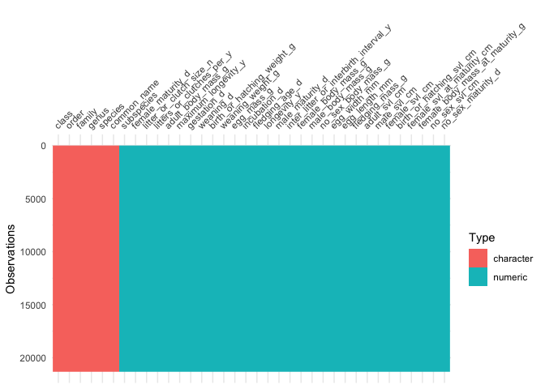
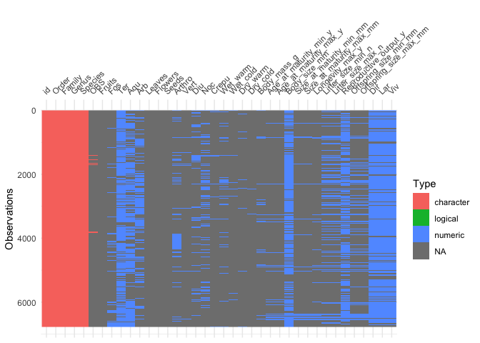

## Instructions
Answer the following questions and complete the exercises in RMarkdown. Please embed all of your code and push your final work to your repository. Your final lab report should be organized, clean, and run free from errors. Remember, you must remove the `#` for the included code chunks to run. Be sure to add your name to the author header above.  

Make sure to use the formatting conventions of RMarkdown to make your report neat and clean!  

## Load the libraries

```r
library(tidyverse)
library(janitor)
library(skimr)
library("naniar")
library(visdat)
```

## Data
**1. For this homework, we will use two different data sets. Please load `amniota` and `amphibio`.**  

`amniota` data:  
Myhrvold N, Baldridge E, Chan B, Sivam D, Freeman DL, Ernest SKM (2015). “An amniote life-history
database to perform comparative analyses with birds, mammals, and reptiles.” _Ecology_, *96*, 3109.
doi: 10.1890/15-0846.1 (URL: https://doi.org/10.1890/15-0846.1).

```r
amniota <- readr::read_csv("data/amniota.csv")
```

```
## Rows: 21322 Columns: 36
```

```
## ── Column specification ────────────────────────────────────────────────────────
## Delimiter: ","
## chr  (6): class, order, family, genus, species, common_name
## dbl (30): subspecies, female_maturity_d, litter_or_clutch_size_n, litters_or...
```

```
## 
## ℹ Use `spec()` to retrieve the full column specification for this data.
## ℹ Specify the column types or set `show_col_types = FALSE` to quiet this message.
```

`amphibio` data:  
Oliveira BF, São-Pedro VA, Santos-Barrera G, Penone C, Costa GC (2017). “AmphiBIO, a global database
for amphibian ecological traits.” _Scientific Data_, *4*, 170123. doi: 10.1038/sdata.2017.123 (URL:
https://doi.org/10.1038/sdata.2017.123).

```r
amphibio <- readr::read_csv("data/amphibio.csv")
```

```
## Rows: 6776 Columns: 38
```

```
## ── Column specification ────────────────────────────────────────────────────────
## Delimiter: ","
## chr  (6): id, Order, Family, Genus, Species, OBS
## dbl (31): Fos, Ter, Aqu, Arb, Leaves, Flowers, Seeds, Arthro, Vert, Diu, Noc...
## lgl  (1): Fruits
```

```
## 
## ℹ Use `spec()` to retrieve the full column specification for this data.
## ℹ Specify the column types or set `show_col_types = FALSE` to quiet this message.
```

## Questions  
**2. Do some exploratory analysis of the `amniota` data set. Use the function(s) of your choice. Try to get an idea of how NA's are represented in the data.**  

```r
skim(amniota)
```


Table: Data summary

|                         |        |
|:------------------------|:-------|
|Name                     |amniota |
|Number of rows           |21322   |
|Number of columns        |36      |
|_______________________  |        |
|Column type frequency:   |        |
|character                |6       |
|numeric                  |30      |
|________________________ |        |
|Group variables          |None    |


**Variable type: character**

|skim_variable | n_missing| complete_rate| min| max| empty| n_unique| whitespace|
|:-------------|---------:|-------------:|---:|---:|-----:|--------:|----------:|
|class         |         0|             1|   4|   8|     0|        3|          0|
|order         |         0|             1|   6|  19|     0|       72|          0|
|family        |         0|             1|   6|  19|     0|      465|          0|
|genus         |         0|             1|   2|  20|     0|     4336|          0|
|species       |         0|             1|   2|  21|     0|    11548|          0|
|common_name   |         0|             1|   2| 306|     0|    19625|          0|


**Variable type: numeric**

|skim_variable                         | n_missing| complete_rate|     mean|         sd|        p0|     p25|     p50|     p75|         p100|hist  |
|:-------------------------------------|---------:|-------------:|--------:|----------:|---------:|-------:|-------:|-------:|------------:|:-----|
|subspecies                            |         0|             1|  -999.00|       0.00|   -999.00| -999.00| -999.00| -999.00|      -999.00|▁▁▇▁▁ |
|female_maturity_d                     |         0|             1|  -723.70|     830.62| -30258.71| -999.00| -999.00| -999.00|      9131.25|▁▁▁▇▁ |
|litter_or_clutch_size_n               |         0|             1|  -383.91|     488.39|   -999.00| -999.00|    1.69|    3.20|       156.00|▅▁▁▁▇ |
|litters_or_clutches_per_y             |         0|             1|  -766.76|     422.48|   -999.00| -999.00| -999.00| -999.00|        52.00|▇▁▁▁▂ |
|adult_body_mass_g                     |         0|             1| 29107.30| 1278639.85|   -999.00|    4.44|   23.61|  135.00| 149000000.00|▇▁▁▁▁ |
|maximum_longevity_y                   |         0|             1|  -737.06|     444.36|   -999.00| -999.00| -999.00|    1.08|       211.00|▇▁▁▁▃ |
|gestation_d                           |         0|             1|  -874.91|     353.92|   -999.00| -999.00| -999.00| -999.00|      7396.92|▇▁▁▁▁ |
|weaning_d                             |         0|             1|  -892.45|     330.67|   -999.00| -999.00| -999.00| -999.00|      1826.25|▇▁▁▁▁ |
|birth_or_hatching_weight_g            |         0|             1|   -88.57|   26484.20|   -999.00| -999.00| -999.00| -999.00|   2250000.00|▇▁▁▁▁ |
|weaning_weight_g                      |         0|             1|  1116.10|  134348.60|   -999.00| -999.00| -999.00| -999.00|  17000000.00|▇▁▁▁▁ |
|egg_mass_g                            |         0|             1|  -739.64|     445.35|   -999.00| -999.00| -999.00|    0.56|      1500.00|▇▁▂▁▁ |
|incubation_d                          |         0|             1|  -820.49|     394.55|   -999.00| -999.00| -999.00| -999.00|      1762.00|▇▂▁▁▁ |
|fledging_age_d                        |         0|             1|  -909.42|     291.29|   -999.00| -999.00| -999.00| -999.00|       345.00|▇▁▁▁▁ |
|longevity_y                           |         0|             1|  -737.82|     443.03|   -999.00| -999.00| -999.00|    1.04|       177.00|▇▁▁▁▃ |
|male_maturity_d                       |         0|             1|  -827.77|     595.69|   -999.00| -999.00| -999.00| -999.00|      9131.25|▇▁▁▁▁ |
|inter_litter_or_interbirth_interval_y |         0|             1|  -932.50|     249.14|   -999.00| -999.00| -999.00| -999.00|         4.85|▇▁▁▁▁ |
|female_body_mass_g                    |         0|             1|    40.59|   27536.51|   -999.00| -999.00| -999.00|   14.50|   3700000.00|▇▁▁▁▁ |
|male_body_mass_g                      |         0|             1|  1242.90|   62044.69|   -999.00| -999.00| -999.00|   13.34|   4545000.00|▇▁▁▁▁ |
|no_sex_body_mass_g                    |         0|             1| 30689.26| 1467346.84|   -999.00| -999.00| -999.00|   27.77| 136000000.00|▇▁▁▁▁ |
|egg_width_mm                          |         0|             1|  -970.48|     168.36|   -999.00| -999.00| -999.00| -999.00|       125.00|▇▁▁▁▁ |
|egg_length_mm                         |         0|             1|  -968.89|     174.10|   -999.00| -999.00| -999.00| -999.00|       455.00|▇▁▁▁▁ |
|fledging_mass_g                       |         0|             1|  -984.64|     211.46|   -999.00| -999.00| -999.00| -999.00|      9992.00|▇▁▁▁▁ |
|adult_svl_cm                          |         0|             1|  -656.15|     490.74|   -999.00| -999.00| -999.00|    9.50|      3049.00|▇▃▁▁▁ |
|male_svl_cm                           |         0|             1|  -985.12|     120.02|   -999.00| -999.00| -999.00| -999.00|       315.20|▇▁▁▁▁ |
|female_svl_cm                         |         0|             1|  -947.35|     223.83|   -999.00| -999.00| -999.00| -999.00|      1125.00|▇▁▁▁▁ |
|birth_or_hatching_svl_cm              |         0|             1|  -940.34|     236.74|   -999.00| -999.00| -999.00| -999.00|       760.00|▇▁▁▁▁ |
|female_svl_at_maturity_cm             |         0|             1|  -989.36|      98.74|   -999.00| -999.00| -999.00| -999.00|       580.00|▇▁▁▁▁ |
|female_body_mass_at_maturity_g        |         0|             1|  -980.61|    1888.55|   -999.00| -999.00| -999.00| -999.00|    194000.00|▇▁▁▁▁ |
|no_sex_svl_cm                         |         0|             1|  -747.14|     442.27|   -999.00| -999.00| -999.00| -999.00|      3300.00|▇▂▁▁▁ |
|no_sex_maturity_d                     |         0|             1|  -942.59|     465.04|   -999.00| -999.00| -999.00| -999.00|     14610.00|▇▁▁▁▁ |

```r
any_na(amniota)
```

```
## [1] FALSE
```

```r
vis_dat(amniota)
```

<!-- -->

**3. Do some exploratory analysis of the `amphibio` data set. Use the function(s) of your choice. Try to get an idea of how NA's are represented in the data.**  

```r
skim(amphibio)
```


Table: Data summary

|                         |         |
|:------------------------|:--------|
|Name                     |amphibio |
|Number of rows           |6776     |
|Number of columns        |38       |
|_______________________  |         |
|Column type frequency:   |         |
|character                |6        |
|logical                  |1        |
|numeric                  |31       |
|________________________ |         |
|Group variables          |None     |


**Variable type: character**

|skim_variable | n_missing| complete_rate| min| max| empty| n_unique| whitespace|
|:-------------|---------:|-------------:|---:|---:|-----:|--------:|----------:|
|id            |         0|          1.00|   7|   7|     0|     6776|          0|
|Order         |         0|          1.00|   5|  11|     0|        3|          0|
|Family        |         0|          1.00|   7|  20|     0|       61|          0|
|Genus         |         0|          1.00|   4|  17|     0|      531|          0|
|Species       |         0|          1.00|   9|  34|     0|     6776|          0|
|OBS           |      6651|          0.02|  13|  86|     0|       53|          0|


**Variable type: logical**

|skim_variable | n_missing| complete_rate| mean|count  |
|:-------------|---------:|-------------:|----:|:------|
|Fruits        |      6774|             0|    1|TRU: 2 |


**Variable type: numeric**

|skim_variable           | n_missing| complete_rate|    mean|      sd|    p0|  p25|    p50|    p75|    p100|hist  |
|:-----------------------|---------:|-------------:|-------:|-------:|-----:|----:|------:|------:|-------:|:-----|
|Fos                     |      6053|          0.11|    1.00|    0.00|  1.00|  1.0|   1.00|   1.00|     1.0|▁▁▇▁▁ |
|Ter                     |      1104|          0.84|    1.00|    0.00|  1.00|  1.0|   1.00|   1.00|     1.0|▁▁▇▁▁ |
|Aqu                     |      2810|          0.59|    1.00|    0.00|  1.00|  1.0|   1.00|   1.00|     1.0|▁▁▇▁▁ |
|Arb                     |      4347|          0.36|    1.00|    0.00|  1.00|  1.0|   1.00|   1.00|     1.0|▁▁▇▁▁ |
|Leaves                  |      6752|          0.00|    1.00|    0.00|  1.00|  1.0|   1.00|   1.00|     1.0|▁▁▇▁▁ |
|Flowers                 |      6772|          0.00|    1.00|    0.00|  1.00|  1.0|   1.00|   1.00|     1.0|▁▁▇▁▁ |
|Seeds                   |      6772|          0.00|    1.00|    0.00|  1.00|  1.0|   1.00|   1.00|     1.0|▁▁▇▁▁ |
|Arthro                  |      5534|          0.18|    1.00|    0.00|  1.00|  1.0|   1.00|   1.00|     1.0|▁▁▇▁▁ |
|Vert                    |      6657|          0.02|    1.00|    0.00|  1.00|  1.0|   1.00|   1.00|     1.0|▁▁▇▁▁ |
|Diu                     |      5876|          0.13|    1.00|    0.00|  1.00|  1.0|   1.00|   1.00|     1.0|▁▁▇▁▁ |
|Noc                     |      5156|          0.24|    1.00|    0.00|  1.00|  1.0|   1.00|   1.00|     1.0|▁▁▇▁▁ |
|Crepu                   |      6608|          0.02|    1.00|    0.00|  1.00|  1.0|   1.00|   1.00|     1.0|▁▁▇▁▁ |
|Wet_warm                |      5997|          0.11|    1.00|    0.00|  1.00|  1.0|   1.00|   1.00|     1.0|▁▁▇▁▁ |
|Wet_cold                |      6625|          0.02|    1.00|    0.00|  1.00|  1.0|   1.00|   1.00|     1.0|▁▁▇▁▁ |
|Dry_warm                |      6572|          0.03|    1.00|    0.00|  1.00|  1.0|   1.00|   1.00|     1.0|▁▁▇▁▁ |
|Dry_cold                |      6735|          0.01|    1.00|    0.00|  1.00|  1.0|   1.00|   1.00|     1.0|▁▁▇▁▁ |
|Body_mass_g             |      6185|          0.09|   94.56| 1093.77|  0.16|  2.6|   9.29|  31.83| 26000.0|▇▁▁▁▁ |
|Age_at_maturity_min_y   |      6392|          0.06|    2.14|    1.18|  0.25|  1.0|   2.00|   3.00|     7.0|▇▇▆▁▁ |
|Age_at_maturity_max_y   |      6392|          0.06|    2.96|    1.69|  0.30|  2.0|   3.00|   4.00|    12.0|▇▇▂▁▁ |
|Body_size_mm            |      1549|          0.77|   66.65|   91.47|  8.40| 29.0|  43.00|  69.15|  1520.0|▇▁▁▁▁ |
|Size_at_maturity_min_mm |      6529|          0.04|   56.63|   55.57|  8.80| 27.5|  43.00|  58.00|   350.0|▇▁▁▁▁ |
|Size_at_maturity_max_mm |      6528|          0.04|   67.46|   66.34| 10.10| 32.0|  50.00|  75.50|   400.0|▇▁▁▁▁ |
|Longevity_max_y         |      6417|          0.05|   11.68|    9.86|  0.17|  6.0|  10.00|  15.00|   121.8|▇▁▁▁▁ |
|Litter_size_min_n       |      5153|          0.24|  530.87| 1575.73|  1.00| 18.0|  80.00| 300.00| 25000.0|▇▁▁▁▁ |
|Litter_size_max_n       |      5153|          0.24| 1033.70| 2955.30|  1.00| 30.0| 186.00| 700.00| 45054.0|▇▁▁▁▁ |
|Reproductive_output_y   |      2344|          0.65|    1.03|    0.43|  0.08|  1.0|   1.00|   1.00|    15.0|▇▁▁▁▁ |
|Offspring_size_min_mm   |      5446|          0.20|    2.45|    1.57|  0.20|  1.4|   2.00|   3.00|    20.0|▇▁▁▁▁ |
|Offspring_size_max_mm   |      5446|          0.20|    2.86|    1.94|  0.40|  1.6|   2.30|   3.50|    25.0|▇▁▁▁▁ |
|Dir                     |      1079|          0.84|    0.30|    0.46|  0.00|  0.0|   0.00|   1.00|     1.0|▇▁▁▁▃ |
|Lar                     |      1079|          0.84|    0.69|    0.46|  0.00|  0.0|   1.00|   1.00|     1.0|▃▁▁▁▇ |
|Viv                     |      1079|          0.84|    0.01|    0.10|  0.00|  0.0|   0.00|   0.00|     1.0|▇▁▁▁▁ |

```r
any_na(amphibio)
```

```
## [1] TRUE
```

```r
vis_dat(amphibio)
```

<!-- -->

**4. How many total NA's are in each data set? Do these values make sense? Are NA's represented by values?**   

`amniota`  

```r
amniota %>% 
  summarise_all(~(sum(is.na(.))))
```

```
## # A tibble: 1 × 36
##   class order family genus species subspecies common_name female_maturity_d
##   <int> <int>  <int> <int>   <int>      <int>       <int>             <int>
## 1     0     0      0     0       0          0           0                 0
## # … with 28 more variables: litter_or_clutch_size_n <int>,
## #   litters_or_clutches_per_y <int>, adult_body_mass_g <int>,
## #   maximum_longevity_y <int>, gestation_d <int>, weaning_d <int>,
## #   birth_or_hatching_weight_g <int>, weaning_weight_g <int>, egg_mass_g <int>,
## #   incubation_d <int>, fledging_age_d <int>, longevity_y <int>,
## #   male_maturity_d <int>, inter_litter_or_interbirth_interval_y <int>,
## #   female_body_mass_g <int>, male_body_mass_g <int>, …
```

`amphibio`  

```r
amphibio %>% 
  summarise_all(~(sum(is.na(.))))
```

```
## # A tibble: 1 × 38
##      id Order Family Genus Species   Fos   Ter   Aqu   Arb Leaves Flowers Seeds
##   <int> <int>  <int> <int>   <int> <int> <int> <int> <int>  <int>   <int> <int>
## 1     0     0      0     0       0  6053  1104  2810  4347   6752    6772  6772
## # … with 26 more variables: Fruits <int>, Arthro <int>, Vert <int>, Diu <int>,
## #   Noc <int>, Crepu <int>, Wet_warm <int>, Wet_cold <int>, Dry_warm <int>,
## #   Dry_cold <int>, Body_mass_g <int>, Age_at_maturity_min_y <int>,
## #   Age_at_maturity_max_y <int>, Body_size_mm <int>,
## #   Size_at_maturity_min_mm <int>, Size_at_maturity_max_mm <int>,
## #   Longevity_max_y <int>, Litter_size_min_n <int>, Litter_size_max_n <int>,
## #   Reproductive_output_y <int>, Offspring_size_min_mm <int>, …
```

**5. Make any necessary replacements in the data such that all NA's appear as "NA".**   

```r
amphibio_tidy <- amphibio %>% 
  na_if("-999")
amniota_tidy <- amniota %>% 
  na_if("-999") 
```

**6. Use the package `naniar` to produce a summary, including percentages, of missing data in each column for the `amniota` data.**  

```r
naniar::miss_var_summary(amniota_tidy)
```

```
## # A tibble: 36 × 3
##    variable                       n_miss pct_miss
##    <chr>                           <int>    <dbl>
##  1 subspecies                      21322    100  
##  2 female_body_mass_at_maturity_g  21318    100. 
##  3 female_svl_at_maturity_cm       21120     99.1
##  4 fledging_mass_g                 21111     99.0
##  5 male_svl_cm                     21040     98.7
##  6 no_sex_maturity_d               20860     97.8
##  7 egg_width_mm                    20727     97.2
##  8 egg_length_mm                   20702     97.1
##  9 weaning_weight_g                20258     95.0
## 10 female_svl_cm                   20242     94.9
## # … with 26 more rows
```

**7. Use the package `naniar` to produce a summary, including percentages, of missing data in each column for the `amphibio` data.**

```r
naniar::miss_var_summary(amphibio_tidy)
```

```
## # A tibble: 38 × 3
##    variable n_miss pct_miss
##    <chr>     <int>    <dbl>
##  1 Fruits     6774    100. 
##  2 Flowers    6772     99.9
##  3 Seeds      6772     99.9
##  4 Leaves     6752     99.6
##  5 Dry_cold   6735     99.4
##  6 Vert       6657     98.2
##  7 OBS        6651     98.2
##  8 Wet_cold   6625     97.8
##  9 Crepu      6608     97.5
## 10 Dry_warm   6572     97.0
## # … with 28 more rows
```

**8. For the `amniota` data, calculate the number of NAs in the `egg_mass_g` column sorted by taxonomic class; i.e. how many NA's are present in the `egg_mass_g` column in birds, mammals, and reptiles? Does this results make sense biologically? How do these results affect your interpretation of NA's?**  

```r
amniota_tidy %>%
  group_by(class) %>%
  select(class, egg_mass_g) %>% 
  naniar::miss_var_summary(order=T)
```

```
## # A tibble: 3 × 4
## # Groups:   class [3]
##   class    variable   n_miss pct_miss
##   <chr>    <chr>       <int>    <dbl>
## 1 Aves     egg_mass_g   4914     50.1
## 2 Mammalia egg_mass_g   4953    100  
## 3 Reptilia egg_mass_g   6040     92.0
```

This does makes sense because mammals dont lay eggs. 

**9. The `amphibio` data have variables that classify species as fossorial (burrowing), terrestrial, aquatic, or arboreal.Calculate the number of NA's in each of these variables. Do you think that the authors intend us to think that there are NA's in these columns or could they represent something else? Explain.**

```r
head(amphibio_tidy)
```

```
## # A tibble: 6 × 38
##   id     Order Family Genus Species   Fos   Ter   Aqu   Arb Leaves Flowers Seeds
##   <chr>  <chr> <chr>  <chr> <chr>   <dbl> <dbl> <dbl> <dbl>  <dbl>   <dbl> <dbl>
## 1 Anf00… Anura Allop… Allo… Alloph…    NA     1     1     1     NA      NA    NA
## 2 Anf00… Anura Alyti… Alyt… Alytes…    NA     1     1     1     NA      NA    NA
## 3 Anf00… Anura Alyti… Alyt… Alytes…    NA     1     1     1     NA      NA    NA
## 4 Anf00… Anura Alyti… Alyt… Alytes…    NA     1     1     1     NA      NA    NA
## 5 Anf00… Anura Alyti… Alyt… Alytes…    NA     1    NA     1     NA      NA    NA
## 6 Anf00… Anura Alyti… Alyt… Alytes…     1     1     1     1     NA      NA    NA
## # … with 26 more variables: Fruits <lgl>, Arthro <dbl>, Vert <dbl>, Diu <dbl>,
## #   Noc <dbl>, Crepu <dbl>, Wet_warm <dbl>, Wet_cold <dbl>, Dry_warm <dbl>,
## #   Dry_cold <dbl>, Body_mass_g <dbl>, Age_at_maturity_min_y <dbl>,
## #   Age_at_maturity_max_y <dbl>, Body_size_mm <dbl>,
## #   Size_at_maturity_min_mm <dbl>, Size_at_maturity_max_mm <dbl>,
## #   Longevity_max_y <dbl>, Litter_size_min_n <dbl>, Litter_size_max_n <dbl>,
## #   Reproductive_output_y <dbl>, Offspring_size_min_mm <dbl>, …
```

```r
amphibio_tidy %>%
  group_by(Species) %>%
  select(Species, Fos, Ter, Aqu, Arb ) %>% 
  naniar::miss_var_summary(order=T)
```

```
## # A tibble: 27,104 × 4
## # Groups:   Species [6,776]
##    Species             variable n_miss pct_miss
##    <chr>               <chr>     <int>    <dbl>
##  1 Allophryne ruthveni Fos           1      100
##  2 Allophryne ruthveni Ter           0        0
##  3 Allophryne ruthveni Aqu           0        0
##  4 Allophryne ruthveni Arb           0        0
##  5 Alytes cisternasii  Fos           1      100
##  6 Alytes cisternasii  Ter           0        0
##  7 Alytes cisternasii  Aqu           0        0
##  8 Alytes cisternasii  Arb           0        0
##  9 Alytes dickhilleni  Fos           1      100
## 10 Alytes dickhilleni  Ter           0        0
## # … with 27,094 more rows
```

This could mean that if something is an NA we should interpret it as it not being that such as forresteal.

**10. Now that we know how NA's are represented in the `amniota` data, how would you load the data such that the values which represent NA's are automatically converted?**

```r
amniota_advance <- 
  readr::read_csv(file = "data/amniota.csv", 
                  na = c("NA", " ", ".", "-999"))
```

```
## Warning: One or more parsing issues, see `problems()` for details
```

```
## Rows: 21322 Columns: 36
```

```
## ── Column specification ────────────────────────────────────────────────────────
## Delimiter: ","
## chr  (6): class, order, family, genus, species, common_name
## dbl (28): female_maturity_d, litter_or_clutch_size_n, litters_or_clutches_pe...
## lgl  (2): subspecies, female_body_mass_at_maturity_g
```

```
## 
## ℹ Use `spec()` to retrieve the full column specification for this data.
## ℹ Specify the column types or set `show_col_types = FALSE` to quiet this message.
```

## Push your final code to GitHub!
Please be sure that you check the `keep md` file in the knit preferences.  
